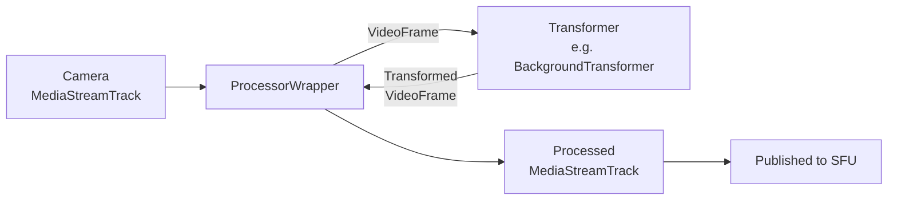

# Video Processors

This document covers the video track processors available in `@livekit/track-processors`.

## BackgroundProcessor

The `BackgroundProcessor` is a prebuilt video processor that supports blurring the background of a user's local video or replacing it with a virtual background image. It can be switched between modes on the fly.

### Available modes

- `BackgroundProcessor({ mode: 'background-blur', blurRadius: 10 })` — Blur the background with an optional blur radius (defaults to 10)
- `BackgroundProcessor({ mode: 'virtual-background', imagePath: "http://path.to/image.png" })` — Replace the background with an image
- `BackgroundProcessor({ mode: 'disabled' })` — Passthrough mode, no effect applied (useful for avoiding switching artifacts, see below)

### Browser support

Before using `BackgroundProcessor`, check for browser compatibility:

```ts
import {
  BackgroundProcessor,
  supportsBackgroundProcessors,
  supportsModernBackgroundProcessors,
} from '@livekit/track-processors';

if (!supportsBackgroundProcessors()) {
  throw new Error('This browser does not support background processors');
}

if (supportsModernBackgroundProcessors()) {
  console.log('This browser supports modern APIs that are more performant');
}
```

### Usage

The simplest approach is to create a processor and attach it to a local video track:

```ts
import { BackgroundProcessor } from '@livekit/track-processors';

const videoTrack = await createLocalVideoTrack();
const processor = BackgroundProcessor({ mode: 'background-blur' });
await videoTrack.setProcessor(processor);
room.localParticipant.publishTrack(videoTrack);
```

### Avoiding visual artifacts when toggling

Calling `videoTrack.setProcessor()` / `videoTrack.stopProcessor()` on demand can produce visual artifacts during the switch. A better approach is to initialize the processor in `disabled` mode up front and use `switchTo()` to toggle effects. This avoids artifacts entirely:

```ts
const videoTrack = await createLocalVideoTrack();
const processor = BackgroundProcessor({ mode: 'disabled' });
await videoTrack.setProcessor(processor);
room.localParticipant.publishTrack(videoTrack);

async function enableBlur(radius) {
  await processor.switchTo({ mode: 'background-blur', blurRadius: radius });
}

async function disableBlur() {
  await processor.switchTo({ mode: 'disabled' });
}
```

## Developing your own video processor

### Architecture overview



Video processors in this package are built on two layers:

1. **`ProcessorWrapper`** — Handles the plumbing of intercepting a video track's frames, passing them through a transformer, and producing a processed output track. It manages browser compatibility (using `MediaStreamTrackProcessor`/`MediaStreamTrackGenerator` where available, with a `canvas.captureStream()` fallback).

2. **A Transformer** (e.g., `BackgroundTransformer`) — Implements the actual frame-by-frame processing logic.

> **Note:** You don't have to follow this `Transformer` + `ProcessorWrapper` pattern. You can implement the `TrackProcessor` interface directly if you prefer. However, using `ProcessorWrapper` is convenient because it abstracts away the `MediaStreamTrack` → `VideoFrame` → transformer → `VideoFrame` → `MediaStreamTrack` conversion, which most use cases don't need to worry about.

To create a custom video processor using `ProcessorWrapper`, instantiate it with your own transformer:

```ts
import { ProcessorWrapper } from '@livekit/track-processors';

const pipeline = new ProcessorWrapper(new MyCustomTransformer(options));
```

### Available base transformers

- **BackgroundTransformer** — Can blur the background, replace it with a virtual background image, or operate in a disabled passthrough state.
